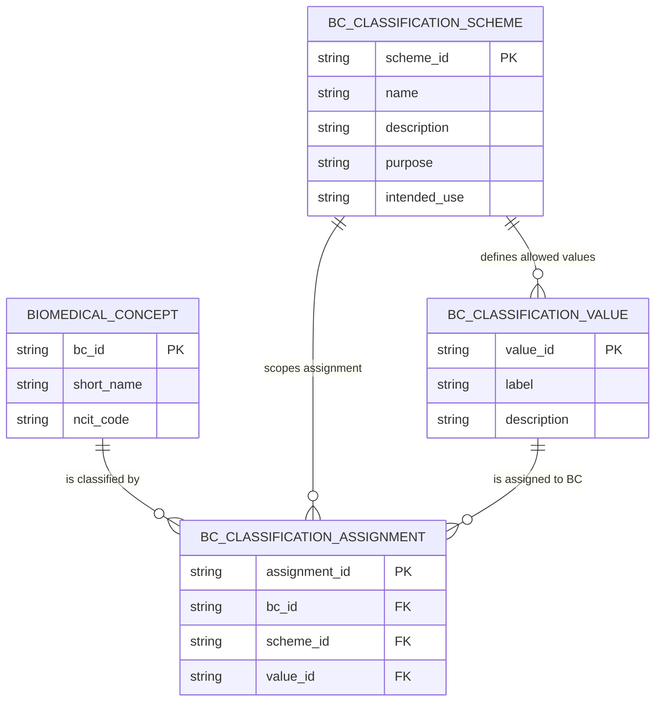

```mermaid
erDiagram
    BIOMEDICAL_CONCEPT ||--o{ BC_CLASSIFICATION_ASSIGNMENT : "is classified by"
    BC_CLASSIFICATION_SCHEME ||--o{ BC_CLASSIFICATION_VALUE : "defines allowed values"
    BC_CLASSIFICATION_SCHEME ||--o{ BC_CLASSIFICATION_ASSIGNMENT : "scopes assignment"
    BC_CLASSIFICATION_VALUE ||--o{ BC_CLASSIFICATION_ASSIGNMENT : "is assigned to BC"

    BIOMEDICAL_CONCEPT {
        string bc_id PK
        string short_name
        string ncit_code
    }

    BC_CLASSIFICATION_SCHEME {
        string scheme_id PK
        string name
        string description
        string purpose
        string intended_use
    }

    BC_CLASSIFICATION_VALUE {
        string value_id PK
        string label
        string description
    }

    BC_CLASSIFICATION_ASSIGNMENT {
        string assignment_id PK
        string bc_id FK
        string scheme_id FK
        string value_id FK
    }
```